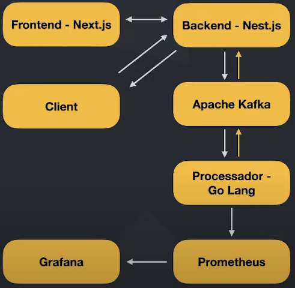

# Imersão Full Cycle 5

### Dinâmica do sistema

### Tecnologias

* Frontend Painel: Next.js

* Backend Painel: Nest.js

* Microsserviço processamento: Golang

* Sistema de mensageria: Apache Kafka

* Stack de métricas: Prometheus e Grafana

* Ambiente de desenvolvimento/implantação: Docker e Kubernetes

### Objetivos

* Desenvolver uma "gateway de pagamento"

* Cada cliente da Gateway terá uma "Account" e um "Secret"

* Cada transação será executada via API Rest

* Quando uma transação é enviada via API, os dados da requisição serão encaminhados para o processador do pagamento

* Haverá um painel onde será possível acompanhar as transações sendo processadas em tempo real

### Pontos importantes

* É uma simulação afim de realizar a comunicação entre microsserviços

* Os sistemas se comunicação de forma síncrona e assíncrona para explorar conceitos e tecnologias utilizadas em grandes empresas que necessitam de aplicações performática e resilientes

### Desafios

* Não misturar a responsabilidade de receber as transações com o processamento das mesmas

  * **Solução**: trabalhar com um microsserviço específico para o processamento das transações

* Ao submeter as transações para o microsserviço de processamento, é preciso ter resiliência para evitar qualquer perda de dado

  * **Solução**: utilização do Apache Kafka. O microsserviço que recebe a solicitação enviará os dados da transação para o Kafka. Do outro lado, o microsserviço responsável por realizar a transação fará a leitura do Kafka. Ao processá-la, o resultado será publicado em um outro tópico do Kafka

### Microsserviços da aplicação

* Microsserviço de "processamento de transações"

  * **Regras de domínio (regras universais)**

    * Uma transação terá apenas 2 `Status`: "approved" ou "rejected"

    * O valor mínimo para cada transação é de "$1,00"

    * O valor máximo para que uma transação seja aprovada é de "$1.000"

    * Toda transação entre os valores de "$1,00" e "$1.000" sempre serão aprovadas

    * Para que uma transação seja aprovada, os dados do cartão de crédito devem ser válidos

  * **Casos de uso**

    * **Process Transaction (processar transação)**

      * Receberá os dados de uma transação

      * Criará um transação

      * Adicionará o cartão de crédito a essa transação

        * Se o cartão de crédito for inválido

          * Os dados da transação serão inseridos no banco de dados com o `status=rejected` contendo a mensagem de erro

          * A transação será publicada no Apache Kafka

      * Caso a transação não seja aprovada (valor da transação não esteja entre "$1" e "$1.000")

        * Os dados da transação será inserido no banco de dados com o `status=rejected` contendo a mensagem do erro

        * A transação será publicada no Apache Kafka

      * Caso a transação seja aprovada

        * Os dados da transação serão inseridos no banco de dados com o `status=approved`

        * A transação será publicada no Apache Kafka

  * **Adaptadores**

    * Apache Kafka

      * Consumo de mensagens

      * Produção das mensagens

    * Banco de dados

      * Conexão com o banco de dados

      * Inserção da transação no banco

      * SQlite (testes) / MySQL (produção)

      * Padrão Repository

    * Presenter

      * Definir o padrão da mensagem a ser enviada via Apache Kafka

  * **Arquitetura: Clean Architecture**

