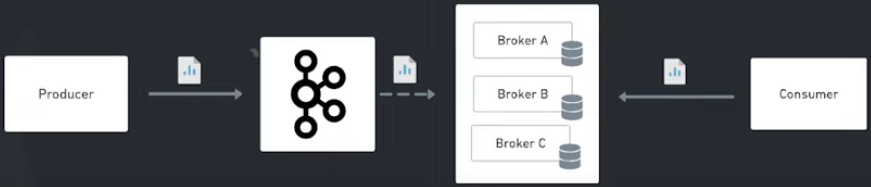
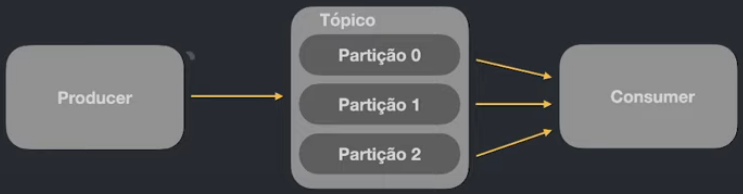
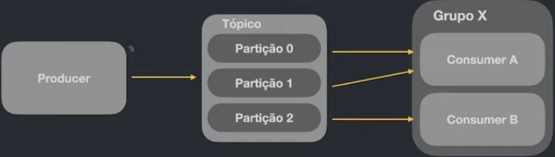
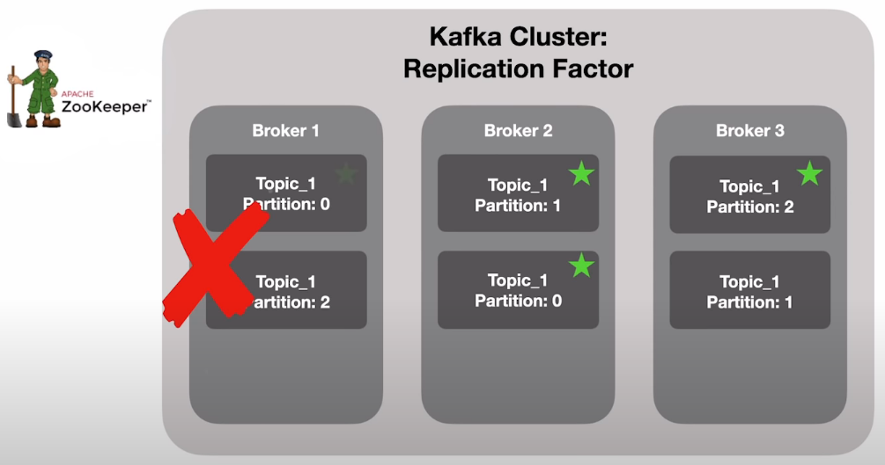
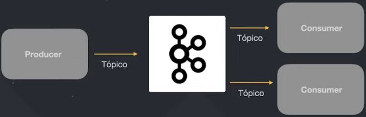
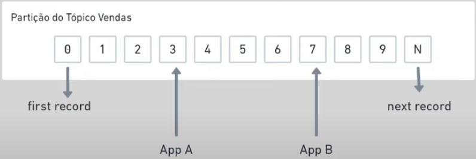
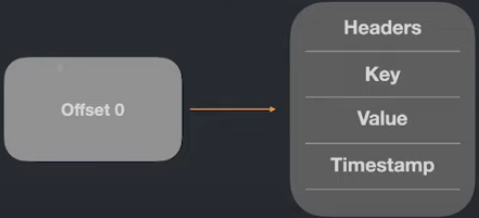
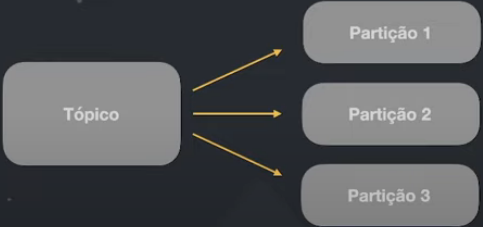
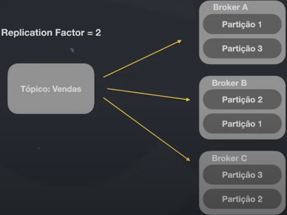

# Apache Kafka e comunicação assíncrona

### Event-driven

* **Exemplos de sistemas que emitem eventos**

  * Carros

  * E-commerce

  * Alarmes

  * Monitoramento

  * Microsserviços

### O mundo dos eventos

* Cada dia mais precisamos processar mais e mais eventos em diversos tipos de plataforma. Desde sistema que precisam se comunicar, _devices para IOT_, monitoramento de aplicações, sistemas de alarmes, etc

### O que é o Apache Kafka?

* É uma plataforma distribuída de streaming de eventos open-source que é utilizada por milhares de empresas para ula alta performance em _pipeline de dados_, _stream de analytics_ integração de de dados e aplicações de missão crítica

* Site: [clique aqui](https://kafka.apache.org/)

### Características do Apache Kafka

* É uma plataforma (possui um ecossistema complexo)

* Trabalha de forma distribuído (alta resiliência)

* Banco de dados para armazenar as mensagens

* Extremamente rápido e com baixa latência

* Utiliza o disco ao invés de memória para processar os dados

### Vantagens do Apache Kafka

* Eventos em tempo real

  * Altíssimo _throughput_

  * Latência extremamente baixa (até 2ms)

* Escalável

* Armazenamento (histórico dos dados)

* Alta disponibilidade

* Se conecta com quase todas as linguagens

* Bibliotecas prontas para as mais diversas tecnologias

* Ferramentas open-source

### Importante

* O Apache Kafka não é apenas uma sistema tradicional de filas como RabbitMQ, Amazon SQS

### Empresas usando Kafka

* Linkedin (criador do Kafka)

* Netflix

* Uber

* Twitter

* Dropbox

* Spotify

* Paypal
 
* Bancos... (**principalmente**)

### Conceitos e dinâmica básica de funcionamento

* **Producer**

  * **Definição**: responsável pelo envio de mensagens(eventos) para o Kafka

  * **Representação**

    

    > Consumer lê os dados contidos dentro das partições

  * **Consumer Groups**

    

    > Aumenta a vazão dos dados (mensagens)

    > **IMPORTANTE**: 1 partição para 1 consumer (Kafka não permite ter 1 partição para 2 ou + consumer)

* **Kafka Cluster**

  * **Definição**
  
    * Conjunto de *Brokers* no Kafka

    * Cada *Broker* é responsável por armazenar os dados de uma partição

    * Cada partição de um *Topic* está distribuído em diferentes *Brokers*

    > **Brokers**: é uma máquina (*server*) com o Kafka instalado nela, com isso podendo armazenar, processar, disponibilizar as mensagens

  * **Replication Factor**

    * **Função**: replicar as partições em *Brokers* diferentes

    * **Representação**

      

    
      * **Apache ZooKeeper**: é um serviço de *Service Discovery* que verificará o status das máquinas (*Brokers*) e caso algum desses *Brokers* não estiver saudável, o **ZooKeeper** faz o rebalanceamento de responsabilidades, e assim define um novo líder do *Topic* afetado

* **Consumer** (aplicação)

  * **Definição**: responsável pela leitura das mensagens(eventos) armazenadas no Kafka

  * **OBS**: o Kafka **não** envia mensagem para o consumer

* **Topic (Tópico)** 
  
  * **Definição**
  
    * É o canal de comunicação responsável por receber e disponibilizar os dados enviados para o Kafka

    * É um Stream de dados que atua como um banco de dados

    * TOdos os dados ficam armazenados em disco, ou seja, cada *Topic* tem seu "local" de armazenamento dos seus dados

    * Um tópico possui diversas **partições**

    * Cada mensagem possui um index (**offset**) que será utilizado pelo *Consumer* para recuperá-lo

  * **Representação**

    

  * **Tópicos são como "Logs"**

    

    > **IMPORTANTE**: os tópicos são **armazenados em disco**, e não em memória

* **Registro**

  * **Definição**: composto por alguns metadados (headers, key, value, timestamp)

  * **Representação**

    

* **Partições**

  * **Definição**
  
    * Cada *Topic* pode ter uma ou mais partições afim de garantir a distribuição e resiliência de seus dados (mensagens e suas réplicas)

    * Cada partição é definido por um número

      * **Exemplo**: 0, 1, 2, ...

  * **OBS**: não é obrigatório definir a quantidade de partições ao criar uma *Topic*

  * **Representação**

    

    > **OBS**: quanto mais partições menores são os riscos

  * **Partições distribuídas**

    

    > Cópias de cada partição distribuídas em vários _brokers_ -> evita perda de dados (mensagens)