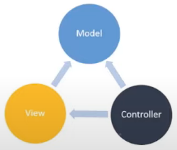
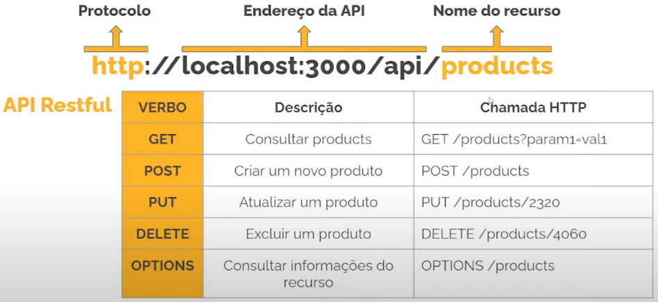

# Microsserviço Nest.js, APIs e publicação assíncrona

## Nest.js

### Definição

* Baseado na arquitetura MVC (arquitetura de camadas)

  

* Typescript em ambiente de desenvolvimento

  > Benefícios: linguagem fortemente tipada, aparição de erros durante o desenvolvimento, mais recursos/funcionalidades do que o JavaScript puro

* Baseado nos ideais arquiteturais do Angular

  > Benefícios: modularidade, injeção de dependência, padrão de nomenclatura de arquivos e diretórios

### Vantagens

* CoC (Convention Over Configuration)

* Typescript

* Arquitetura escalável

* Integração fácil com vários tipos de banco de dados_

* Suporte a microsserviços

* Suporte a criação de API Rest, GraphQL

### Importante: "O que o Nest.js não é?"

* Não é Angular

* Não é React

* Não é Vue.js

* Não é um framework front-end

### Importante: "Ciladas ao usar o Nest.js"

* Não ficar preso a um framework

* Não pular etapas (estudar e fixar os fundamentos da linguagem)

  

---

## API Rest

### Definição

* API = Application Program Interface

* REST = Representational State Transfer

* Utilização do Protocolo HTTP/HTTPS

### Importância de uma API

Comunicação entre serviços, independentemente de tecnologia

### Estrutura da requisição

