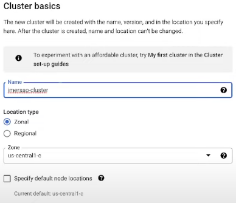
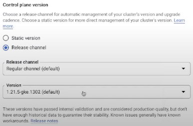

# Orquestração de containers com Kubernetes

> ## Kubernetes (K8S)

### **Definição**

É uma produto *Open Source* utilizado para automatizar a implantação, o dimensionamento e o gerenciamento de aplicativos em containers

### **Origem**

* **Borg**: criado pelo Google com a finalidade de rodar processos (*jobs*) em uma grande quantidade de *clusters*

* **Omega**: aprimoramento do **Borg**

> **OBS**: devido à origem do K8S, o GCP (Google Could Platform) é o melhor *Cloud Provider* para Kubernetes

### **Características**

* É disponibilizado através de ua conjunto de APIs

* Normalmente o acesso à API é feito a partir do *CLI* (Command Line Interface): `kubectl`

* Baseado em estado (configuração do estado é feito a partir de conjunto de objetos)

### **Estrutura**

* ***Kubernetes Master Node***

  * **Função**: responsável por gerenciar os outros nós do *cluster K8S*

  * **Serviços disponibilizados pelo K8S**

    * *Kube-apiserver*

    * *Kube-controller-manager*

    * *Kube-scheduler*

* **Outros *Nodes***

  * *Kubelet*

  * *Kubeproxy*

### **Dinâmica de funcionamento**

* **Cluster**: conjunto de máquinas (*nodes*)

* Cada máquina possui uma quantidade de **vCPU** e **memória**

  > Os recursos de cada *node* são especificados no arquivo de configuração do Kubernetes

* **Pods**: unidade que contém os containers provisionados. Cada *Pod* representa um processo (um container) rodando no *Cluster*

  

  > **OBS**: é possível colocar vários containers em um único *Pod*, porém não é recomendado, exceto se os serviços rodando dentro desses containers sejam extremante dependentes entre si

---

> ## Deploy de aplicação no GCP

### Criação do *cluster Kubernetes*

* Menu > "Kubernetes Engine" > "Clusters"
  
  

* "Create" > Na opção "GKE Standard", clicar em "Configure"

  

* Em "Cluster basic", informar os dados dos seguintes campos: "Name", "Location Type", "Version"

  

  

  > **OBS**: o campo "Version" é referente a versão do Kubernetes utilizado no Cluster

* "NODE POOLS" > "default-pool"

  

* Em "Node pool details", especificar o número de *Nodes* no *Cluster*

  

  

* Após ter realizado os passos anteriores, será iniciado a criação do seu *cluster Kubernetes*

  > **OBS**: esse processo pode levar algum tempo...

---

> ## Confluent Cloud

### Criação de um *cluster Kafka*

* "Add cluster" > No menu "Create cluster", clicar na opção "Basic" > "Begin configuration"

  

### Criação de *Topics*

* No menu "Topics" > "Create topic"

  

* **Criação de um *Topic* com as configurações padrão**: No menu "New topic", informar os seguintes campos: "Topic name", "Number of partitions > "Create with defaults"

  

* **Criação de um *Topic* com as configurações customizadas**: No menu "New topic", informar os seguintes campos: "Topic name", "Number of partitions > "Customize settings"

  

  

---

> ## Decodificar um Secret (em Base64) no shell

### Sintaxe

```bash
$ echo "[secret]" | base64 -d
```

### Exemplo

```bash
$ echo "bXlzcWw=" | base64 -d
```

> **Saída**: `mysql`